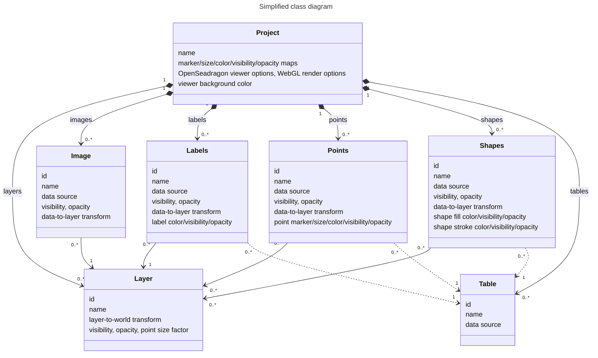

# Data model

A single **_Project_** can hold multiple rendered data objects (**_Images_**, **_Labels_**, **_Points_**, **_Shapes_**).

Each rendered data object is shown on a single **_Layer_**; multi-item data (e.g. points, shapes) can be distributed across multiple layers.

Rendered data objects representing multi-item data (_Labels_, _Points_, _Shapes_) can be annotated by a **_Table_**, whose columns can be used for item configuration.

The following simplified class diagram outlines this conceptual model, ignoring any functions/methods and inheritance structures.

