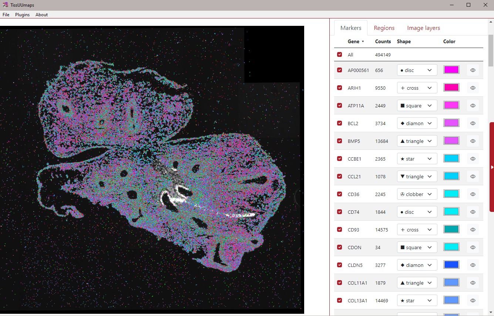

# Using TissUUmaps for exploring ISS data
This tutorial contains instructions how to explore in situ sequencing (ISS) data in TissUUmaps. ISS data are stored in a .csv file which contain minimum 3 columns: X, Y coordinates and marker identity (for example, gene or cell type).

## Example with gene counts
1. Load the DAPI image into TissUUmaps, it will be used as a background for the displayed markers. You can do it by dragging and dropping the image file into TissUUmaps space, or using the `File > Open` menu.
1. Inspect the .csv file containing gene markers in Excel to understand its structure. It contains three columns: X, Y and Gene (resp. X and Y coordinates of each point on the DAPI image, and its corresponding gene name).

    
1. Load the .csv file into TissUUmaps, either by drag and drop again, or through the Markers tab in TissUUmaps, using the `[+]` button.
1. Give a new name to the created Tab (for example: `"Gene Counts"`) and select X and Y columns as coordinates.
1. You can already display your markers by clicking on **[Update view]**. All markers will have the same color and be in one group named “All”.
1. In **Render Options**, group markers by Gene name, by selecting the Gene column as Key.
1. Click **[Update view]** again, to see how markers are divided into different gene names, with different colors and shapes.
1. In the gene table, hover your mouse on the  icon in the marker list to display one gene at a time, or select multiple genes using the checkboxes  on the left.
    

> **Note**  
> In case something is not clear you can always search for help in our documentation: https://tissuumaps.github.io/TissUUmaps-docs/.
    