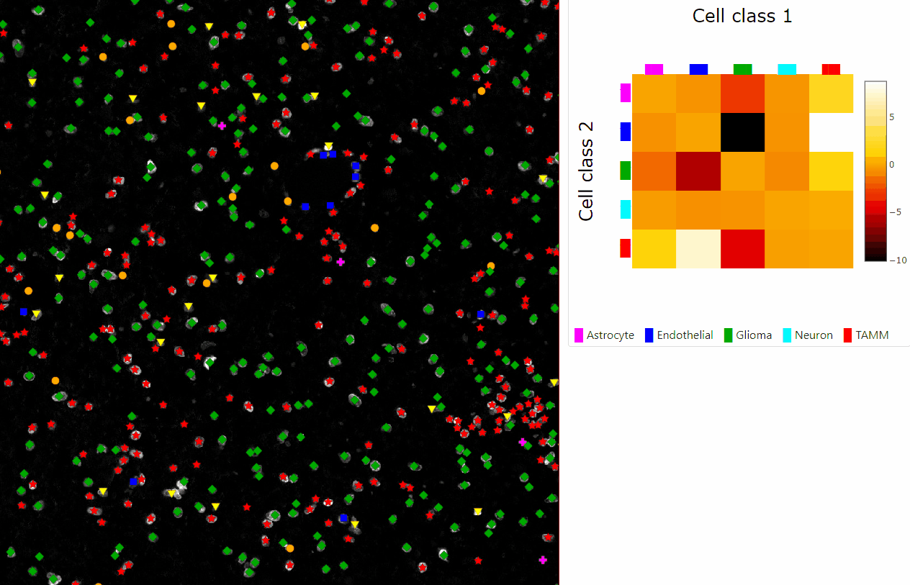

# Using TissUUmaps for exploring QuPath output and cell-cell interactions
InteractionV&QC plugin is for visualization and quality control of cell-cell interactions. In order to run this plugin, you need a .csv file containing markers and a .csv file containing neighborhood enrichment test matrix. In the following lines, we also show you how to get a .csv file containing neighborhood enrichment test matrix.

## Interaction:

> **Note**  
> To simplify saving TissUUmaps projects, always keep all files used in a common project (`.tif` and `.csv`) inside one folder.

1. Open the menu **Plugins -> Add plugin**, check the boxes in front of the plugin InteractionV&QC, click Install, and re-start TissUUmaps.
1. Open TissUUmaps.
1. Load a DAPI image. You can do it by dragging and dropping the .tif image file into TissUUmaps space.
1. Now load the `.csv` file of one classification marker dataset by clicking on tab Markers, clicking the `[+]` button, selecting the desired file from your computer under the section **File and coordinates - Choose file**.
1. You can change the Tab name to any desired name, then you need to select the column names from the .csv file corresponding to the X and Y coordinates.
1. In the section **Render Options**, you can define a key to group by, that is a column from the `.csv` file which will be used to display the dataset grouped by different colors and shapes of the marker.
1. Click the **[Update View]** button.
1. Save the project as a `.tmap` file by opening the menu **File -> Save project**. In order to save the project together with the .csv file, it is necessary to generate a button first. A warning window appears and you need to generate the button. The path to the .csv file needs to be relative to the path of the image.
1. Then you select a suitable directory to save the project and write the project file name, i.e. `My_project.tmap`, and the project is saved.
1. Next, we want to calculate the neighborhood enrichment test (NET) and save the results as a .csv file: Click on this <a href="https://colab.research.google.com/drive/1KN9hkFp_ZpJcB4jQxajHlHNHbMe0Ts4N?usp=sharing" target="_blank">Google Colab link</a> and copy the notebook to your drive by clicking `File -> Save a copy in Drive`. Now the notebook has been copied to your Google Drive.
1. Upload the `.csv` file which will be analyzed by clicking the icon of a folder () saying `Files` on the left panel, then clicking icon  saying `Upload to session storage` and choose the `.csv` file from your computer. The file will be subsequently uploaded into Google Colab.
1. Replace the file name with the one you uploaded at:
    ```python
    file_name = '5_10_B.csv' #define which file_name to load:
    ```
1. Define the column names of X, Y coordinates and the classification results at: 
    ```python
    #define column name containing X coordinates:
    X_name = 'cx'
    #define column name containing X coordinates:
    Y_name = 'cy'
    # define column name containing classification results:
    Classification = 'final_class'
    ```
1. Run the notebook, start by pressing the symbol play  in the first notebook element, then click on the second element and click on the tab `Runtime -> Run after`. This will result in saving the output matrix from NET and a `.csv` file named `Neighborhood_enrichment_test_file_name_squidpy.csv` in the local session. Download this file to your computer by right click on the file and selecting Download. (The result will be lost when the notebook is closed).
1. Now we can go back to the TissUUmaps software.
1. Open the plugin **InteractionV&QC** by clicking the menu **Plugins -> InteractionQC**.
1. In the dropdown menu `Select marker dataset` - select the marker dataset which will be used for the interactive visualization of the NET matrix, 
1. In the menu `Select file` - select the `.csv` file from the computer which was downloaded from the Google Colab notebook.
1. Then click the button **[Display Neighborhood Enrichment Test]** to load the .csv file and displays an interactive matrix where you can click on the elements and see the corresponding two cell types on top of the displayed image in the spatial viewport.

    

> **Note**  
> In case something is not clear you can always search for help in our documentation: https://tissuumaps.github.io/TissUUmaps-docs/.