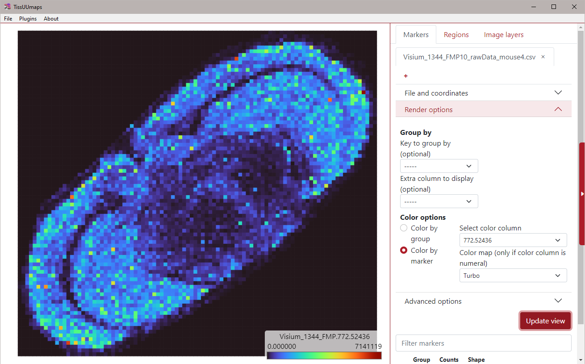

# Load and look at multidimensional data in TissUUmaps
This tutorial contains instructions how to explore multidimensional data in TissUUmaps. Multidimensional data is a .csv file which contains two columns of x and y coordinates and numerous other columns containing feature measurenets in those locations. Examples of this kind of data is MALDI Mass Spectrometry or Visium Spatial Gene Expression.

## General
1. In the figure below, you can see an example of a multidimensional dataset, this one contains many columns: X, Y and a range of mass values from MALDI.

    
1. Load the csv marker file into TissUUmaps, either by drag and drop, or through the Markers tab in TissUUmaps, using the `[+]` button.
1. Give a new name to the created Tab (for example: `MALDI data`) and select X and Y columns as coordinates.
1. You can already display your markers by clicking on **[Update view]**. All markers will have the same color and be in one group named “All”.
1. In **Render Options**, select `Color by marker` option, and chose one of the mass values in the `Select color column` dropdown.
1. Choose a color map (for example: `Turbo`) from the `Color map` dropdown
1. In **Advanced Options**, change the marker size factor to `3.2`, then select `Use a fixed shape` with the `square` option, and check `Remove outline` from the **Marker shape** section:
    
    <kbd>
        
    </kbd>
1. Click **[Update view]** again.
1. In **Render Options**, change the mass value in the `Select color column` dropdown to display a different mass distribution. Don't forget to press the **[Update view]** button after changing the value.

    

> **Note**  
> You can test an online version of TissUUmaps to see how a project can be shared: https://tissuumaps.scilifelab.se/private/Christophe/massspec/project.tmap

> In case something is not clear you can always search for help in our documentation: https://tissuumaps.github.io/TissUUmaps-docs/.
